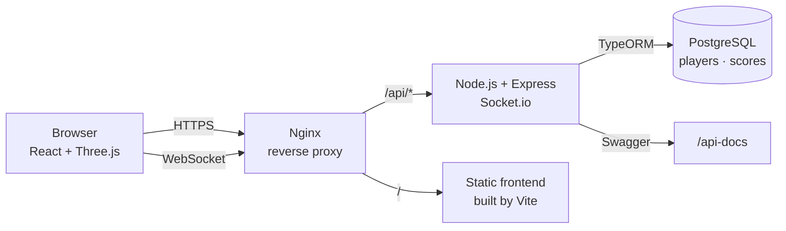
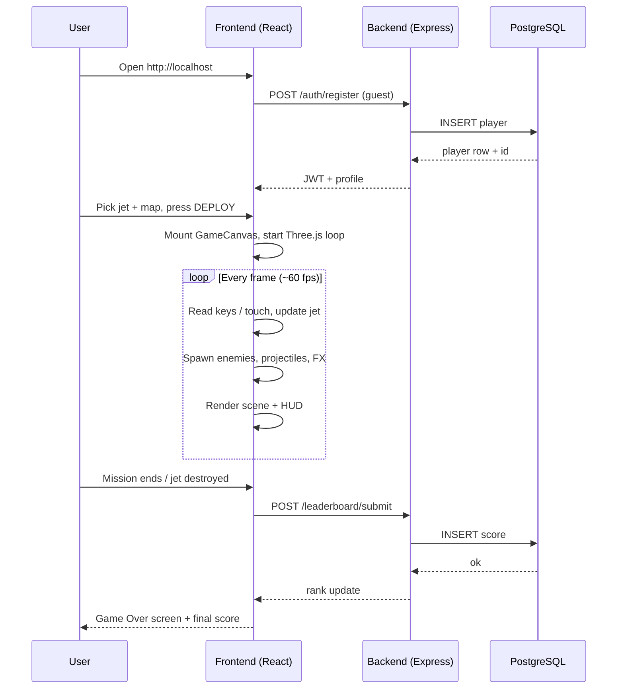
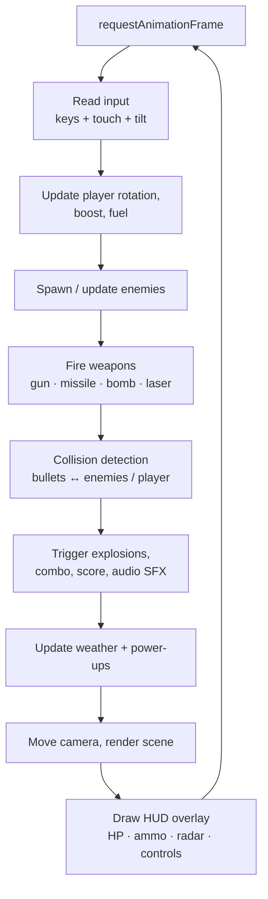
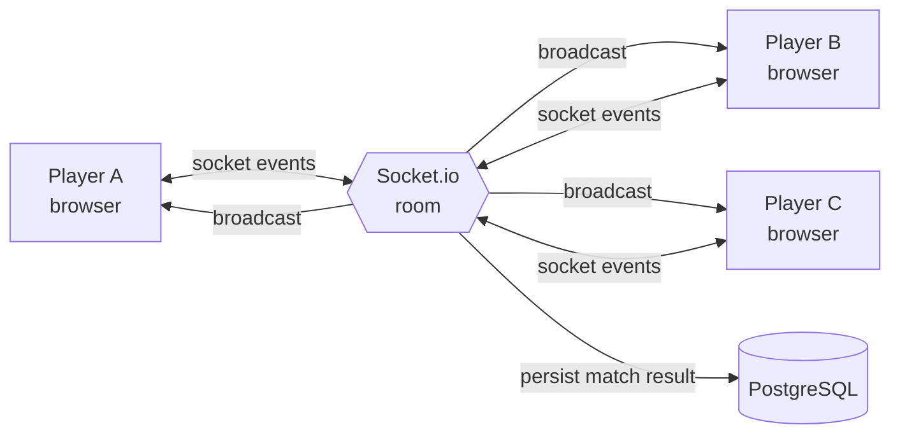

# Airplane Attack Game


A 3D real-time multiplayer aerial combat game on the web.

[](https://img.shields.io/badge/React-20232A?style=for-the-badge&logo=react&logoColor=61DAFB)
[](https://img.shields.io/badge/TypeScript-3178C6?style=for-the-badge&logo=typescript&logoColor=white)
[](https://img.shields.io/badge/Three.js-000000?style=for-the-badge&logo=three.js&logoColor=white)
[](https://img.shields.io/badge/Node.js-339933?style=for-the-badge&logo=node.js&logoColor=white)
[](https://img.shields.io/badge/PostgreSQL-4169E1?style=for-the-badge&logo=postgresql&logoColor=white)
[](https://img.shields.io/badge/Docker-2496ED?style=for-the-badge&logo=docker&logoColor=white)

---

## Slide 1 — Introduction

> **Airplane Attack** is a browser-based 3D aerial combat game built as a complete full-stack application.
> Pick a jet, choose a map, and fight enemies and bosses solo — or jump online and battle other players in real time.
> No download, no launcher. Open a browser, fly.

### What is this project?


Airplane Attack is a real-time, browser-playable fighter-jet game. The whole experience — 3D rendering, physics, audio, multiplayer rooms, leaderboard, and player accounts — lives in a single full-stack codebase that you can spin up locally with one Docker command.

You take control of one of four fighter aircraft (F-16, F-22, Su-57, or a Stealth prototype), choose between five themed maps (Ocean, Desert, Snow, City, Night Sky), and engage waves of AI enemies — small fighters, fast interceptors, heavy bombers, and bosses — or join a Socket.io-powered multiplayer room and fight other players head-to-head or in teams.


### At a glance

| Property         | Value                                                        |
|------------------|--------------------------------------------------------------|
| **Genre**        | 3D arcade flight combat                                      |
| **Platform**     | Web browser (desktop + mobile)                               |
| **Modes**        | Mission · Survival · PvP · Team                              |
| **Players**      | Single-player and online multiplayer (Socket.io rooms)       |
| **Persistence**  | Player profiles, coins, XP, unlocked jets, global scores     |
| **Deployment**   | One-command Docker Compose stack                             |
| **License**      | Open-source, fork-friendly                                   |


## Slide 3 — Technology Stack

### Frontend

[](https://img.shields.io/badge/React-20232A?style=for-the-badge&logo=react&logoColor=61DAFB)
[](https://img.shields.io/badge/TypeScript-3178C6?style=for-the-badge&logo=typescript&logoColor=white)
[](https://img.shields.io/badge/Three.js-000000?style=for-the-badge&logo=three.js&logoColor=white)
[](https://img.shields.io/badge/Vite-646CFF?style=for-the-badge&logo=vite&logoColor=white)
[](https://img.shields.io/badge/Zustand-000000?style=for-the-badge&logo=react&logoColor=white)

### Backend

[](https://img.shields.io/badge/Node.js-339933?style=for-the-badge&logo=node.js&logoColor=white)
[](https://img.shields.io/badge/Express-000000?style=for-the-badge&logo=express&logoColor=white)
[](https://img.shields.io/badge/Socket.io-010101?style=for-the-badge&logo=socket.io&logoColor=white)
[](https://img.shields.io/badge/TypeORM-E83524?style=for-the-badge&logo=typeorm&logoColor=white)
[](https://img.shields.io/badge/JWT-000000?style=for-the-badge&logo=jsonwebtokens&logoColor=white)

### Database

[](https://img.shields.io/badge/PostgreSQL-4169E1?style=for-the-badge&logo=postgresql&logoColor=white)

### Infra & Tooling

[](https://img.shields.io/badge/Docker-2496ED?style=for-the-badge&logo=docker&logoColor=white)
[](https://img.shields.io/badge/Nginx-009639?style=for-the-badge&logo=nginx&logoColor=white)
[](https://img.shields.io/badge/Swagger-85EA2D?style=for-the-badge&logo=swagger&logoColor=black)

---

## Slide 4 — Core Features

> Every feature listed below is implemented in this repository. The game ships with four flyable jets, five maps, four weapon types, six enemy classes, dynamic weather, full mobile + desktop input, and a complete online backend.

### Jet Roster


Four flyable aircraft, each with distinct stats pulled straight from `frontend/src/types/Jet.ts`.

| Jet         | Speed | Armor | Damage | Missiles | Unlock | Role                                 |
|-------------|-------|-------|--------|----------|--------|--------------------------------------|
| **F-16**    | 40    | 100   | 8      | 6        | Free   | Balanced multirole fighter           |
| **F-22**    | 50    | 110   | 10     | 8        | 1500   | Air superiority, high speed          |
| **Su-57**   | 48    | 120   | 11     | 8        | 2000   | Heavy hitter with thrust vectoring   |
| **Stealth** | 45    | 90    | 14     | 4        | 3500   | Low signature, glass cannon          |

### Game Modes

- **Mission Mode** — Objective-driven runs with a scripted boss spawn at ~60 seconds
- **Survival Mode** — Escalating waves; spawn rate ramps up the longer you stay alive
- **Multiplayer PvP** — Free-for-all rooms over Socket.io
- **Multiplayer Team** — Co-op / team-vs-team matches with shared scoring

### Maps & Environment

- **Five Themed Maps** — Ocean, Desert, Snow, City, Night Sky
- **Dynamic Weather System** — Clear, clouds, rain, thunder
- **Per-map Lighting & Skybox** — Each scene has its own atmosphere
- **Power-up Spawns** — Health, missile reload, fuel, shield drops in-flight

### Weapons & Combat

- **Machine Gun** — Continuous fire on `Space`
- **Missiles** — `R` to lock and fire on tracked targets
- **Laser** — `L` for a precision energy beam
- **Bombs** — `B` to drop ground-targeted ordnance
- **Missile Lock-On** — Reticle locks within the forward cone, audible cue on lock
- **Boss Battles** — Heavy enemies with multi-stage health pools

### Enemy Variety

- **Small** — Cheap, numerous, fast to kill
- **Fast** — Maneuverable interceptors
- **Bomber** — Heavy armor, slow, fires back
- **Boss** — End-of-mission encounter with multi-stage health
- **Spawn Pacing** — Mission uses a fixed cadence; Survival ramps from 2.5 s → tighter as time progresses

### HUD & Interface


- **Always-on Control Panel** — Every key + matching symbol shown during gameplay
- **Health Bar** — Color-coded HP indicator (top-left)
- **Ammo + Fuel Gauges** — Missile count and fuel ratio
- **Radar Minimap** — Player (green), enemies (red), boss (gold) blips
- **Kill Combo Tracker** — Stacking score multiplier with timer
- **Reward Popups** — Live `+SCORE`, `+POWERUP`, `+KILL` feedback
- **Targeting Reticle** — Crosshair with lock indicator
- **70% Browser Zoom Layout** — Wide-screen-friendly scaling

### Player Progression

- **Coins & XP** — Earned per kill, mission, and survival time
- **Levels** — Persistent profile progression
- **Unlockable Jets** — F-16 free; F-22, Su-57, Stealth purchased with coins
- **Upgrade System** — Engine, armor, missile, fuel, radar upgrades
- **Daily Rewards** — Login-based bonus coins / XP

### Backend & Online

- **Guest Login** — One-tap "Continue as Guest" — no email required
- **Account Auth** — JWT-based register / login
- **Global Leaderboard** — Score, kills, and survival time submitted on game-over
- **Socket.io Rooms** — Real-time multiplayer state sync
- **Swagger API Docs** — Auto-generated at `/api-docs`
- **PostgreSQL Persistence** — Players, scores, and match history

### Cross-Input Controls

- **Keyboard + Mouse** — Primary desktop input (W/A/S/D + Q/E + Space/R/B/L)
- **Touch Joystick** — Mobile virtual stick for pitch / yaw
- **On-screen Buttons** — FIRE, MSL, BOOST for touch devices
- **Tilt Support** — Optional gyroscope-driven yaw on mobile
- **Audible Key Feedback** — Short click confirms every control press

### Audio

- **Synthesized Background Music** — Web Audio arpeggio + bass drone (no mp3 required)
- **Key-Press SFX** — Click on every control input
- **Combat SFX** — Missile launch, gun fire, explosion, alarm-on-hit
- **Engine Loop** — Constant ambient hum while flying
- **Music / SFX Toggles** — Independent on/off in Settings

### Features at a Glance

| Category    | Highlights                                                        |
|-------------|-------------------------------------------------------------------|
| Jet Roster  | 4 flyable jets with distinct speed / armor / damage profiles      |
| Game Modes  | Mission, Survival, PvP, Team                                      |
| Maps        | Ocean, Desert, Snow, City, Night Sky + dynamic weather            |
| Weapons     | Gun, missile (lock-on), laser, bombs                              |
| Enemies     | Small, Fast, Bomber, Boss                                         |
| HUD         | Always-on control panel, radar, combo, reward popups              |
| Progression | Coins, XP, levels, jet unlocks, upgrades, daily rewards           |
| Online      | JWT auth, global leaderboard, Socket.io rooms, Swagger docs       |
| Input       | Keyboard + mouse, touch joystick, on-screen buttons, tilt         |
| Audio       | Synth music + bass drone, key clicks, combat SFX, settings toggle |

---

## Slide 5 — Flow & Processing

### High-level architecture



### Player session flow



### Per-frame game loop



### Multiplayer event flow



---

## Slide 6 — Getting Started

```bash
# clone & boot the whole stack
docker compose up --build

# then open
http://localhost          # game
http://localhost/api-docs # API reference (Swagger)
```

> Frontend hot-reloads via Vite. Backend uses `ts-node-dev`. Database state persists in the `postgres/` volume.

---

## End of Presentation — Time to Fly
